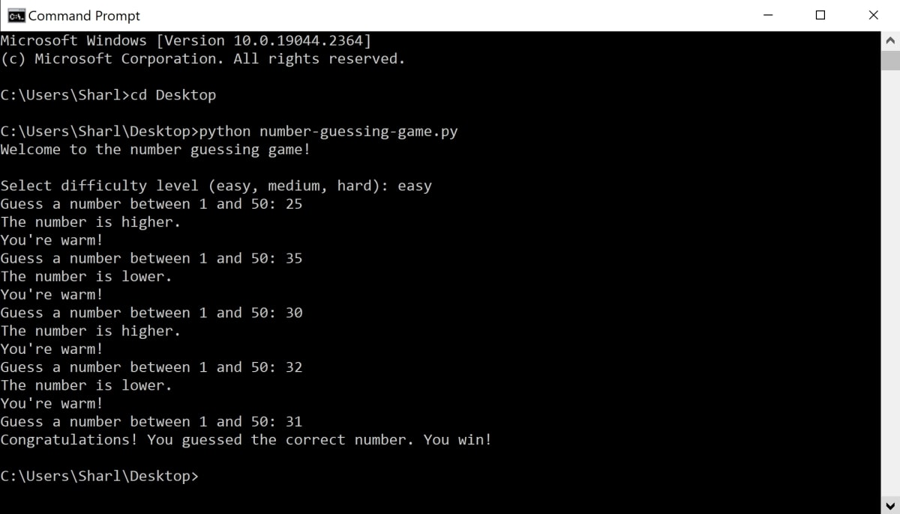

# number-guessing-game-python
This is a python script that contains a number guessing game. It includes:
* Setting a limited number of guesses
* Adding hints to the game
* Letting the player choose the difficulty

## To Run

* Navigate to one of the folders that contains the script using a terminal or command line. 
* Use the python command to run the game: 
`python number-guessing-game.py`

## Example

